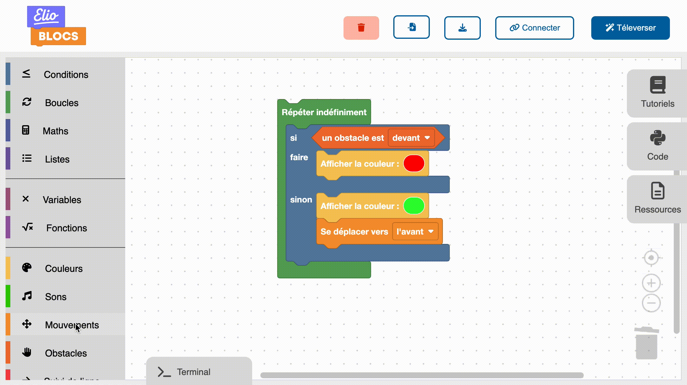

# Présentation d'Elioblocs

Elioblocs est une application type scratch qui donne la possibilité de concevoir des programmes avec des blocs.
La programmation à base de blocs est une méthode très populaire, car elle permet de visualiser son programme
et son déroulement simplement avec des codes couleurs et des intéraction avec les blocs.

Après avoir créé son programme, on peut directement le tester sur Eliobot, le robot d'Elio.
Elioblocs gère aussi la mise à jour de la librairie d'Eliobot, pour une utilisation simple.

## Blockly

Elioblocs est basé sur la librairie [Blockly](https://developers.google.com/blockly), une librairie open-source développée par Google,
elle est très modulaire et permet de créer des blocs de programmation comme on le souhaite.

Blockly est utilisé dans de nombreux projets, comme [Scratch](https://scratch.mit.edu/), [App Inventor](https://appinventor.mit.edu/), [Code.org](https://code.org/), etc.