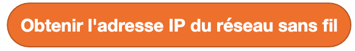
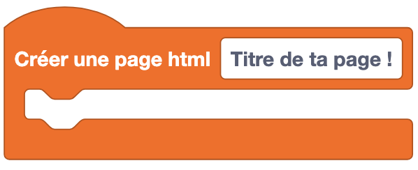
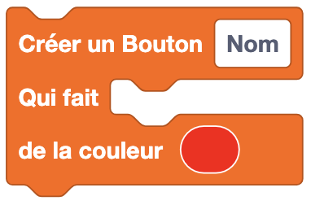
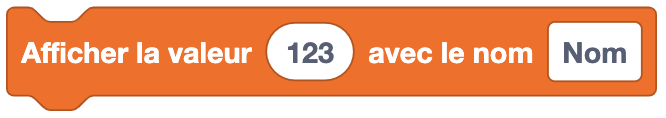
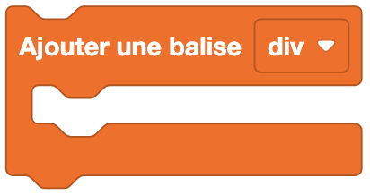
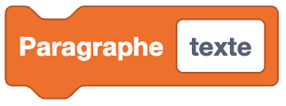

Les blocs de réseau permettent de réaliser des actions liées à la connexion d'Eliobot à un réseau sans fil.

## **Connexion Sans Fil**

---

### Se connecter à un réseau sans fil

**Type** : Commande

**Définition** :

Ce bloc permet de connecter Eliobot à un réseau sans fil. Il faut renseigner le nom du réseau et le mot de passe.
Les informations de connexion sont stockées dans un fichier nommé `settings.toml` sur Eliobot, ce qui permet de ne pas avoir à les renseigner à chaque fois.
Eliobot se connectera automatiquement au réseau sans fil au démarrage.

**Utilisation** :

Si tu veux que Eliobot se connecte à un réseau sans fil pour pouvoir accéder à internet ou à un serveur local.

### Se déconnecter d'un réseau sans fil

**Type** : Commande

**Définition** :

Ce bloc permet de déconnecter Eliobot d'un réseau sans fil.

**Utilisation** :

Si tu veux que Eliobot se déconnecte d'un réseau sans fil pour se connecter à un autre réseau ou pour économiser de l'énergie.

### Ouvrir un point d'accès depuis Eliobot

**Type** : Commande

**Définition** :

Ce bloc permet d'ouvrir un point d'accès Wi-Fi depuis Eliobot. Cela permet à d'autres appareils de se connecter à Eliobot comme ton téléphone ou ton ordinateur.

**Utilisation** :

Si tu veux servir un fichier html depuis Eliobot pour faire de ton telephone une télécommande par exemple.

### Est connecté à un réseau sans fil ?

**Type** : Bloc booléen

**Définition** :

Ce bloc permet de tester si Eliobot est connecté à un réseau sans fil. Il renvoie `vrai` si Eliobot est connecté à un réseau sans fil et `faux` sinon.

**Utilisation** :

Si tu veux réaliser une action seulement si Eliobot est connecté à un réseau sans fil.

### Scanner les réseaux sans fil disponibles

**Type** : Valeur

**Définition** :

Ce bloc permet de scanner les réseaux sans fil disponibles. Il renvoie une liste des réseaux sans fil disponibles avec leur nom et leur force de signal.

**Utilisation** :

Si tu veux afficher les réseaux sans fil disponibles pour choisir à quel réseau se connecter.

### Obtenir l'adresse IP du réseau sans fil

**Type** : Valeur

**Définition** :

Ce bloc permet d'obtenir l'adresse IP du réseau sans fil auquel Eliobot est connecté.

**Utilisation** :

Si tu veux connaître l'adresse IP du réseau sans fil pour communiquer avec Eliobot, tu en auras besoin pour te connecter à Eliobot depuis un autre appareil.

---

### Crée une page html

**Type** : Commande

**Définition** :

Ce bloc permet de créer une page html. Une page html est une page web qui peut être affichée dans un navigateur web.
Elle sera enregistrée dans un fichier html sur Eliobot appelé `index.html` et sera placé dans le dossier `www`.
Tu peux y choisir le titre de la page et placer son contenu à l'intérieur. Une fois placer ce bloc désactive toutes les boucles
répétées indéfiniment pour démarrer le serveur web, tu peux y accéder en te connectant à Eliobot en mode point d'accès
et en renseignant l'adresse IP de Eliobot dans ton navigateur web.

**Utilisation** :

Si tu veux créer une page web pour afficher des informations et placer des éléments interactifs comme des boutons ou des afficheurs.

### Ajouter un bouton à ta page html

**Type** : Commande

**Définition** :

Ce bloc permet d'ajouter un bouton à une page html.
Un bouton est un élément interactif qui peut être cliqué par l'utilisateur.
Tu peux y choisir le texte du bouton et le code qui sera exécuté lorsque le bouton sera cliqué.
Tu peux aussi choisir la couleur du bouton.

**Utilisation** :

Si tu veux réaliser une télécommande pour contrôler Eliobot depuis ton téléphone.

### Ajouter un afficheur à ta page html

**Type** : Commande

**Définition** :

Ce bloc permet d'ajouter un afficheur à une page html, un afficheur est un élément qui affiche la valeur que tu lui donnes.
Tu peux placer la valeur que tu veux afficher à l'intérieur de l'afficheur et le nom de l'afficheur.

**Utilisation** :

Si tu veux savoir si un obstacle est devant Eliobot depuis ton téléphone.

### Crée une balise html

**Type** : Commande

**Définition** :

Ce bloc permet de créer une balise html. Une balise html est un élément d'une page web qui permet de structurer le contenu.
Tu peux y choisir le type de la balise et placer son contenu à l'intérieur.

Options disponibles :
- div
- center

**Utilisation** :

Si tu veux structurer le contenu de ta page html.

### Crée un titre html

**Type** : Commande

**Définition** :

Ce bloc permet de créer un titre html. Un titre html est un texte qui va être d'une certaine taille et en gras.
Tu peux y choisir le texte du titre et sa taille.

Options disponibles :
- h1
- h2
- h3
- h4
- h5
- h6

**Utilisation** :

Si tu veux afficher un titre dans ta page html.

### Crée un paragraphe html

**Type** : Commande

**Définition** :

Ce bloc permet de créer un paragraphe html. Un paragraphe html est un texte qui va être affiché dans la page web.

**Utilisation** :

Si tu veux afficher un texte dans ta page html.
