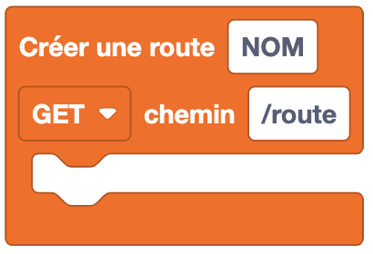
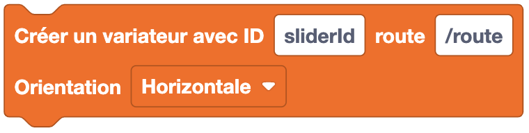

Les blocs de réseau permettent de réaliser des actions liées à la connexion d'Eliobot à un réseau sans fil.

## **Connexion Sans Fil**

---

### Se connecter à un réseau sans fil

**Type** : Commande

**Définition** :

Ce bloc permet de connecter Eliobot à un réseau sans fil. Il faut renseigner le nom du réseau et le mot de passe.
Le mot de passe web est un mot de passe personnel qui sert à l'authentification, tu peux choisir le mot de passe que tu veux.
Les informations de connexion sont stockées dans un fichier nommé `settings.toml` sur Eliobot, ce qui permet de ne pas avoir à les renseigner à chaque fois.
Une fois utilisé même si tu changes de programme, Eliobot se connectera automatiquement au réseau sans fil que tu as renseigné précédemment.

**Utilisation** :

Si tu veux que Eliobot se connecte à un réseau sans fil pour pouvoir accéder à internet ou à un serveur local.

### Se déconnecter d'un réseau sans fil

**Type** : Commande

**Définition** :

Ce bloc permet de déconnecter Eliobot d'un réseau sans fil.

**Utilisation** :

Si tu veux que Eliobot se déconnecte d'un réseau sans fil pour se connecter à un autre réseau ou pour économiser de l'énergie.

### Ouvrir un point d'accès depuis Eliobot

**Type** : Commande

**Définition** :

Ce bloc permet d'ouvrir un point d'accès Wi-Fi depuis Eliobot. Cela permet à d'autres appareils de se connecter à Eliobot comme ton téléphone ou ton ordinateur.

**Utilisation** :

Si tu veux servir un fichier html depuis Eliobot pour faire de ton telephone une télécommande par exemple.

### Est connecté à un réseau sans fil ?

**Type** : Bloc booléen

**Définition** :

Ce bloc permet de tester si Eliobot est connecté à un réseau sans fil. Il renvoie `vrai` si Eliobot est connecté à un réseau sans fil et `faux` sinon.

**Utilisation** :

Si tu veux réaliser une action seulement si Eliobot est connecté à un réseau sans fil.

### Scanner les réseaux sans fil disponibles

**Type** : Valeur

**Définition** :

Ce bloc permet de scanner les réseaux sans fil disponibles. Il renvoie une liste des réseaux sans fil disponibles avec leur nom et leur force de signal.

**Utilisation** :

Si tu veux afficher les réseaux sans fil disponibles pour choisir à quel réseau se connecter.

### Obtenir l'adresse IP du réseau sans fil

**Type** : Valeur

**Définition** :

Ce bloc permet d'obtenir l'adresse IP du réseau sans fil auquel Eliobot est connecté.

**Utilisation** :

Si tu veux connaître l'adresse IP du réseau sans fil pour communiquer avec Eliobot, tu en auras besoin pour te connecter à Eliobot depuis un autre appareil.

## **Serveur Http**

---

### Créer une route API

**Type** : Commande

**Définition** :

Ce bloc permet de créer une route API. Une route API est une adresse web qui permet de réaliser des actions sur Eliobot quand on y accède depuis un navigateur web ou une application.

**Utilisation** :

Si tu veux créer une route API pour réaliser des actions sur Eliobot depuis un navigateur web ou une application.

### Créer une route API avec retour

**Type** : Commande

**Définition** :

Ce bloc permet de créer une route API avec retour. Une route API avec retour est une adresse web qui permet de réaliser des actions sur Eliobot quand on y accède depuis un navigateur web ou une application et qui renvoie une valeur.

**Utilisation** :

Si tu veux créer une route API avec retour pour réaliser des actions sur Eliobot depuis un navigateur web ou une application et récupérer une valeur de retour pour l'afficher ou pour servir un fichier.

### Récupérer l'état d'un bouton

**Type** : Bloc booléen

**Définition** :

Ce bloc permet de récupérer l'état d'un bouton. Il renvoie `vrai` si le bouton est activé et `faux` sinon.
Il prend en paramètre le numéro du bouton à tester, c'est ce qui l'identifie.

**Utilisation** :

Si tu veux réaliser une action seulement si le bouton html est activé.

### Récupérer l'état d'un variateur

**Type** : Valeur

**Définition** :

Ce bloc permet de récupérer la valeur d'un variateur. Il renvoie la valeur du variateur.
Il prend en paramètre le numéro du variateur à tester, c'est ce qui l'identifie.

**Utilisation** :

Si tu veux récupérer la valeur d'un variateur html pour réaliser une action en fonction de cette valeur.

### Envoyer une valeur en JSON

**Type** : Valeur

**Définition** :

Ce bloc permet d'envoyer une valeur en JSON. Il prend en paramètre sont id (identifiant), la valeur à envoyer et doit être utilisé dans une route API.

**Utilisation** :

Si tu veux envoyer une valeur en JSON depuis une route API et la récupérer depuis une page html par exemple.

### Servir le contenu d'un fichier

**Type** : Valeur

**Définition** :

Ce bloc permet de servir le contenu d'un fichier. Il prend en paramètre le nom du fichier à servir et son chemin sur Eliobot.

**Utilisation** :

Si tu veux servir un fichier html, css, javascript depuis Eliobot pour l'afficher dans un navigateur web.

### Démarrer le serveur web

**Type** : Commande

**Définition** :

Ce bloc permet de démarrer le serveur web. Pour y accéder, il faut connaître l'adresse IP d'Eliobot.

**Utilisation** :

Si tu veux démarrer le serveur web pour servir des fichiers html, css, javascript depuis Eliobot.

## **Page HTML**

---

### Crée une page html

**Type** : Commande

**Définition** :

Ce bloc permet de créer une page html. Une page html est une page web qui peut être affichée dans un navigateur web.
Elle sera enregistrée dans un fichier html sur Eliobot appelé `index.html` et sera placé dans le dossier `www`.
Tu peux y choisir le titre de la page et placer son contenu à l'intérieur.

**Utilisation** :

Si tu veux créer une page web pour afficher des informations.

### Crée une balise html

**Type** : Commande

**Définition** :

Ce bloc permet de créer une balise html. Une balise html est un élément d'une page web qui permet de structurer le contenu.
Tu peux y choisir le type de la balise et placer son contenu à l'intérieur.

Options disponibles :
- div
- center

**Utilisation** :

Si tu veux structurer le contenu de ta page html.

### Crée un titre html

**Type** : Commande

**Définition** :

Ce bloc permet de créer un titre html. Un titre html est un texte qui va être d'une certaine taille et en gras.
Tu peux y choisir le texte du titre et sa taille.

Options disponibles :
- h1
- h2
- h3
- h4
- h5
- h6

**Utilisation** :

Si tu veux afficher un titre dans ta page html.

### Crée un paragraphe html

**Type** : Commande

**Définition** :

Ce bloc permet de créer un paragraphe html. Un paragraphe html est un texte qui va être affiché dans la page web.

**Utilisation** :

Si tu veux afficher un texte dans ta page html.

### Crée un bouton html

**Type** : Commande

**Définition** :

Ce bloc permet de créer un bouton html. Un bouton html est un élément interactif qui permet de réaliser une action quand on clique dessus.
Tu peux y choisir le texte du bouton, sa couleur, la route à laquelle il va envoyer son état et l'ID du bouton, c'est ce qui l'identifie.

**Utilisation** :

Si tu veux créer un bouton interactif dans ta page html.

### Crée un variateur html

**Type** : Commande

**Définition** :

Ce bloc permet de créer un variateur html. Un variateur html est un élément interactif qui permet de choisir une valeur entre un minimum et un maximum.
Tu peux y choisir son ID, c'est ce qui l'identifie, la route à laquelle il va envoyer sa valeur et si tu veux qu'il soit placé horizontalement ou verticalement.

**Utilisation** :

Si tu veux créer un variateur interactif dans ta page html.

### Récupérer une valeur

**Type** : Commande

**Définition** :

Ce bloc permet de créer un espace où sera afficher la valeur depuis une route que tu as créée n'oublie pas de spécifier le bon id (identifiant du bloc).

**Utilisation** :

Si tu veux récupérer une valeur depuis une route que tu as créée et l'afficher dans ta page html.