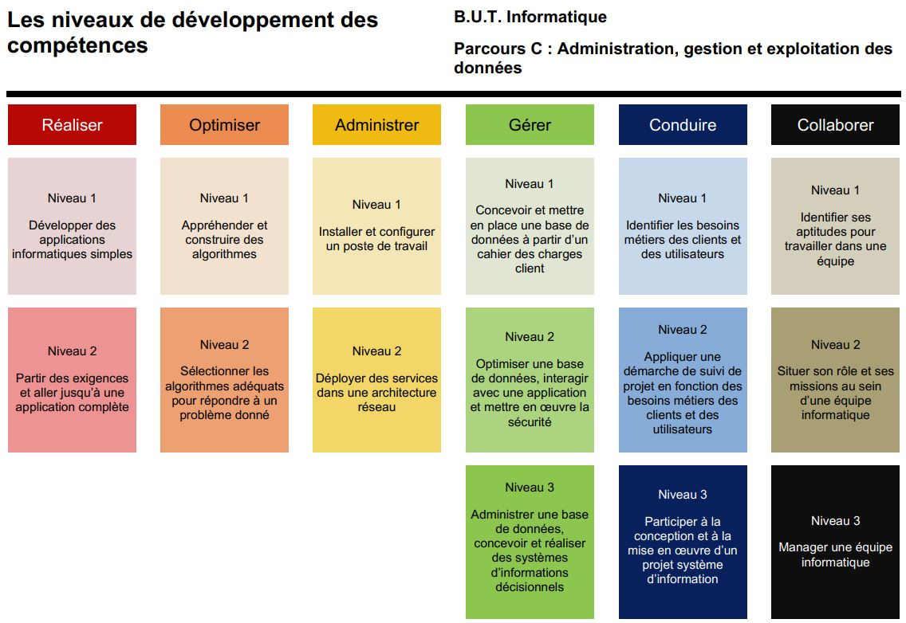

# Le BUT Informatique – Parcours Data/IA

Cette page présente le cadre de ma formation dans laquelle s’inscrivent les projets et compétences développés au cours de ce mémoire.

## Objectifs de la formation

Le **BUT Informatique**, ou Bachelor Universitaire de Technologie, est une formation professionnalisante en trois ans dispensée en IUT.  
Le parcours **Data/IA** (Data et Intelligence Artificielle) forme des étudiants capables de :

- manipuler, analyser et exploiter des données,
- développer des outils d’aide à la décision,
- mettre en œuvre des modèles d’apprentissage automatique,
- comprendre les enjeux de l’intelligence artificielle.

Ce parcours met l’accent sur la rigueur scientifique, la programmation, la gestion de projet et l’autonomie.

## Compétences visées

La formation est construite autour de 6 compétences principales :

- **C1. Réaliser un développement d'application**
- **C2. Optimiser des applications**
- **C3. Administrer des systèmes informatiques communicants complexes**
- **C4. Gérer des données de l'information**
- **C5. Conduire un projet**
- **C6. Collaborer au sein d'une équipe informatique**

Le présent mémoire est organisé autour de ces six compétences, avec une attention particulière portée sur les compétences C4 à C6 développées en BUT 3.
La compétence C4, "Gérer des données de l'information", est particulièrement mise en avant dans le cadre de la formation DATA/IA.

## Alternance et rythme

La deuxième et troisième année s’effectue en **alternance**, ce qui permet d’alterner entre :

- des périodes de formation à l’IUT,
- et des périodes professionnelle en entreprise.

Ce rythme d’alternance favorise l’application directe des choses apprise dans des projets concrets, et l’acquisition d’expériences professionnelles.

Mon référent pédagogique à L'IUT est M. Cyrille Suire.

## Pourquoi j’ai choisi ce parcours

Intéressé par la programmation et les données, j’ai choisi le parcours **Data/IA** du BUT Informatique pour approfondir mes compétences techniques tout en développant une compréhension des enjeux de l’intelligence artificielle.
L’alternance m’a permis de découvrir le monde professionnel tout en gardant un lien fort avec l’univers académique. Ce double ancrage a été un plaisir pour moi.
