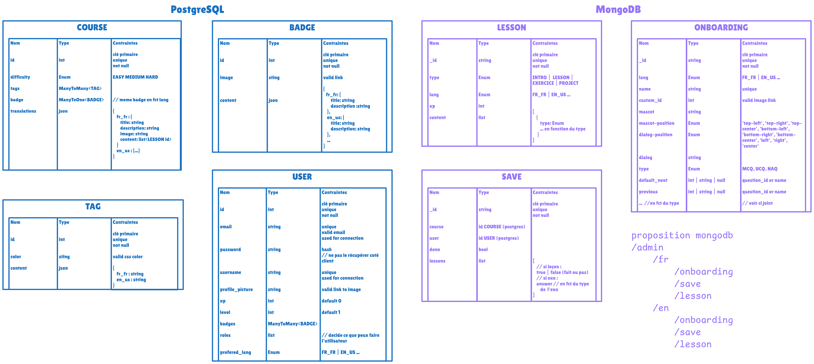
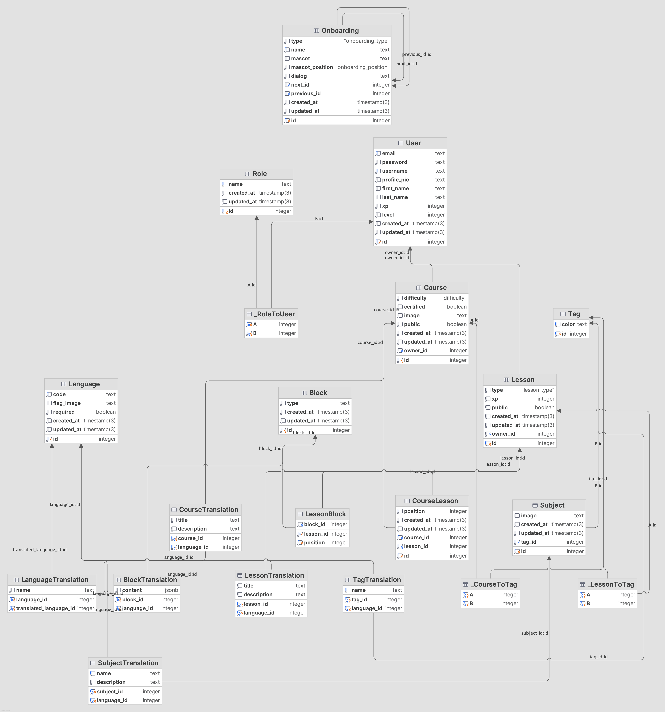
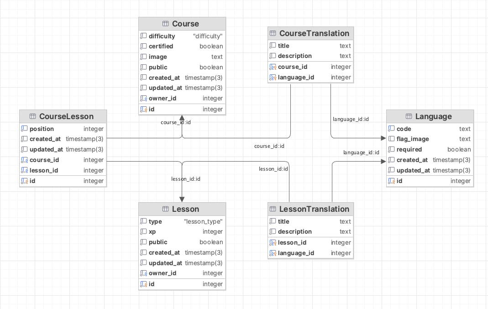

# Gérer des données de l'information

La compétence **C4** du BUT Informatique, intitulée *Gérer des données de l'information*, est au cœur de la formation.  
En troisième année, elle est validée via les UE 5.4 et 6.4, avec pour objectifs :  
**Administrer une base de données, concevoir et réaliser un projet de système d'information décisionnel.**

Dans le parcours Data/IA à Niort, cette compétence est également abordée sous l’angle de la science des données et de l’intelligence artificielle, notamment grâce aux enseignements de M. Cyrille Suire, qui a enrichi le programme dans ce sens.

---

## Objectifs de la compétence C4

Cette compétence vise à former les étudiants à :

- Concevoir et administrer des bases de données adaptées à différents contextes,
- Gérer des systèmes d'information complexes et évolutifs,
- Mettre en œuvre des solutions efficaces pour le stockage, l’organisation et la restitution des données,
- Garantir la qualité, la confidentialité et la sécurité des données manipulées,

Dans le cadre du parcours Data/IA, elle s’étend aussi à :

- La gestion et le traitement de volumes importants de données (Big Data),
- La structuration de données en vue d’analyses statistiques ou d’apprentissage automatique.

---

## Projets mobilisés

Pour illustrer la compétence C4, je m’appuie sur mes deux projets fil rouge réalisés en BUT 3 :

- **Plateforme éducative ELIO Academy**
- **Robot suiveur de ligne avec IA embarquée**

---

## Exemple 1 : Plateforme éducative ELIO Academy

Ce projet a été initié par Romain Boutrois, fondateur d’Elio. J’ai été sollicité très tôt pour accompagner la réflexion sur la structuration technique de la plateforme, afin de l'aider à concevoir un système d'information robuste et évolutif. Je vais me servir de ce projet pour illustrer les différentes phases de gestion des données, de la conception initiale à l’optimisation de l’architecture.

### Phase 1 : Conception initiale du MVP

Étant seul au développement au début du projet, Romain a rapidement compris qu'on avait besoin d'un MVP (Minimum Viable Product) pour tester l’idée et valider le concept. Tout seul la comception du MVP aurait pris l'entièreté de mon temps et il me restais quelque missions importantes à réaliser pour Elioblocs. Après concertation avec Cyrille Suire (mon tuteur d'alternance), il nous a proposé de confier le développement du MVP à une équipe d’étudiants en BUT3 parcours Full-Stack, qui avais besoin d’un projet professionnel pour leur formation.
Le développement du premier MVP a donc été confié à l'équipe d'étudiants sur 5 semaines.  
Mon rôle : suivre, guider et valider leurs choix techniques pour garantir une base solide et maintenable.
Le but était que je puisse reprendre le projet par la suite et le faire évoluer.

Une idée initiale était d’ajouter une dimension communautaire (commentaires, forums...), mais nous avons opté pour une solution externe plus mature (Discourse). Cela a permis de réduire la charge de développement pour le MVP.  
Si cette dimension avait été développée en interne, un système orienté graphe comme Neo4j aurait pu être envisagé, notamment pour gérer efficacement les relations sociales et les interactions entre utilisateurs.
Ce choix n'a pas forcément été compris par l'équipe d'étudiant j'y reviens plus bas.

#### Architecture initiale

Le besoin était clair : la plateforme devait gérer à la fois des données très structurées (comptes utilisateurs, profils, rôles, récompenses, sujets) et des données plus dynamiques et hétérogènes (onboarding, parcours, exercices, blocs).

Le choix initial s’est porté sur une architecture à double base de données :
- **PostgreSQL** pour les données dites *froides* (comptes utilisateurs, badges, statistiques...),
- **MongoDB** pour les données *chaudes* (parcours, leçons, exercices), plus évolutives et moins structurées.

Ce choix avait du sens :
- PostgreSQL est robuste, fiable, parfaitement adapté aux relations complexes.
- MongoDB permet une grande souplesse pour les structures de documents qui évoluent dans le temps.

Le choix est resté le même tout au long de cette première phase.

  
> Ce diagramme illustre l'architecture initiale avec les deux bases de données, conçue par les étudiants du projet.

### Phase 2 : Reprise du projet et refonte de l’architecture

Lorsque j’ai repris le projet avec un stagiaire ayant participé à la conception, nous avons pris la décision de **fusionner les deux bases**.

> Cette décision répondait à plusieurs constats :
> - La gestion de deux moteurs augmentait la complexité (ORM distincts, cohérence difficile à maintenir...),
> - Cela demandait des ressources serveur et une surveillance technique supplémentaires,
> - À l’échelle de la start-up, ce n’était pas soutenable en termes de maintenance.

Nous avons donc basculé l’ensemble du projet sur PostgreSQL, en exploitant notamment le type `JSON` pour gérer les cas où les données restaient semi-structurées (comme certains blocs de contenu dynamiques).

Ce choix a permis :
- De réduire considérablement la complexité du backend,
- De centraliser la logique de requêtage et de validation,
- D’avoir une base plus simple à sauvegarder (une seule sauvegarde sur le S3), à tester et à faire évoluer.

  
> Ce diagramme illustre la nouvelle architecture avec une seule base de données PostgreSQL.  
> La lecture du schéma est plus complexe en raison de la présence de plusieurs tables intermédiaires pour gérer les relations entre les entités (parcours, leçons, exercices, langues...),  
> mais cette solution reste plus simple à maintenir et à administrer qu’une architecture à double base. Une fois les relations comprises, les requêtes deviennent plus intuitives.

---

### Problème résolu : gestion des traductions de contenu

Un point bloquant dans l’ancienne version était la gestion des traductions.  
Avec MongoDB, les contenus non structurés étaient stockés par langue dans des listes, sans lien direct avec leur supérieur hiérarchique.  
Résultat :
- Impossible de savoir rapidement quelles traductions étaient absentes,
- Difficile de maintenir à jour les contenus multilingues,
- Risque de proposer des parcours partiellement traduits aux utilisateurs.

Nous avons donc mis en place une structure relationnelle claire, par exemple pour les leçons :

- Une table `Lesson`,
- Une table `Language`,
- Une table `LessonTranslation`, liée aux deux précédentes.

Ainsi, chaque leçon peut être reliée à ses différentes versions linguistiques.  
Cela permet :
- De lister les leçons non traduites pour une langue donnée,
- De garantir une couverture cohérente du contenu dans toutes les langues actives,
- De faciliter les mises à jour par l’équipe pédagogique.

Ce modèle est également utilisé pour les autres données multilingues, comme les parcours ou les blocs de contenu.

  
> Sur ce schéma, on voit comment les leçons sont liées aux traductions via une table intermédiaire (`translations`), elle-même reliée à la table des langues.  
> Ce modèle rend les relations explicites et permet une gestion fiable des contenus multilingues.  
> On voit aussi que les leçons sont liées à un parcours via une table intermédiaire (`CourseLessons`), ce qui permet de gérer l'ordre des leçons dans un parcours et de réutiliser les leçons sans duplication.

---

### Bénéfices de cette approche

Cette refonte a permis de :
- Simplifier la gestion des données en réduisant le nombre de technologies à maîtriser,
- Améliorer la cohérence des données en centralisant les informations dans une seule base,
- Faciliter les requêtes complexes en exploitant les fonctionnalités de PostgreSQL (jointures, indexation...),
- Accélérer le développement de nouvelles fonctionnalités grâce à une maintenance allégée.

### Bilan et perspectives

Ce projet m’a permis de mettre en pratique la compétence C4 dans un contexte réel, en concevant une architecture de données robuste et évolutive.  
J’ai été confronté à des choix techniques complexes, à la gestion de données hétérogènes et à l’optimisation des performances dans un environnement de production contraint.  
Cette expérience a renforcé ma compréhension des enjeux liés à la gestion de l’information dans un système moderne.  
Une problématique inattendue est apparue : la gestion du coût d’hébergement et de la scalabilité, un point que je n’avais pas anticipé au début du projet.  
J’ai donc dû apprendre à optimiser les requêtes, à utiliser les index, et à surveiller les performances de la base pour garantir une expérience utilisateur fluide.

---

## Exemple 2 : Suivi de ligne avec IA

Ce second projet a été mené dans le cadre d’un projet tutoré, entre mon entreprise Elio et ma formation.  
Il visait à explorer un nouveau type de contenu pédagogique : apprendre à entraîner un modèle d’intelligence artificielle simple.  
L’objectif était de proposer un exemple concret, accessible, pouvant être réutilisé à des fins éducatives sur la plateforme Elio Academy.  
Le but était de tester si toutes les étapes pouvaient être accessibles au plus grand nombre, même sans compétences en IA.

---

### Contexte 

Eliobot est équipé de :

* **Capteurs infrarouges (IR) x5** placés sous le châssis pour détecter la réflectivité du sol,
* **Moteurs x2** contrôlant les roues, avec un pilotage différentiel,
* **Un microcontrôleur ESP32-S2**, responsable du traitement des données capteurs et de la prise de décisions.

Chaque échantillon contient :

* **Valeurs des 5 capteurs IR**, normalisées entre 0 et 1 (0 = ligne détectée, 1 = pas de ligne détectée),
* **Commandes des deux moteurs** (gauche et droit) codées en booléen (0 = éteint, 1 = allumé).

**Exemple de deux échantillons :**

| Sensor0 | Sensor1 | Sensor2 | Sensor3 | Sensor4 | MotorA | MotorB |
| ------- | ------- | ------- | ------- | ------- | ------ | ------ |
| 1       | 1       | 0       | 1       | 1       | 1      | 1      |
| 1       | 1       | 1       | 1       | 0       | 0      | 1      |

* Données enregistrées via l’ESP32-S2 sur un parcours test,
* Fichier CSV produit (3730 échantillons).

---

### Apports liés à la compétence C4

Ce projet m’a permis de valider plusieurs aspects de la compétence C4 dans un contexte très différent du premier :

- Gestion d’un flux de données capteurs en conditions réelles (lecture, enregistrement, structuration),
- Prétraitement des données : nettoyage, normalisation, transformation pour l’entraînement,
- Utilisation d’outils d’analyse : entraînement d’un modèle de classification binaire sous TensorFlow.

Le développement mené n’a pas abouti à un résultat pleinement concluant, mais il a démontré qu’il est possible, avec peu de données, d’entraîner un modèle simple pour des tâches de classification binaire.  
Ce travail peut être réutilisé dans d'autres projets similaires, et intégré dans des parcours pédagogiques pour former les utilisateurs à l’entraînement de modèles d’IA.

Il montre que je suis capable de mobiliser mes compétences autour des données, aussi bien dans un système d’information web complexe que dans un dispositif embarqué temps réel.

---

## Problème résolu : collecte des données

Dans ce projet, j’ai dû concevoir un système de collecte de données en temps réel à partir des capteurs du robot.  
L’objectif était de récolter des données réelles pour entraîner un modèle d’IA capable de piloter le robot de manière autonome.

Pour cela, j’ai développé un programme sur l’ESP32-S2 qui :
- suit la ligne de manière basique (sans IA) à l’aide de logique simple (ex. : si le capteur central détecte la ligne → avancer ; si capteur gauche → tourner à gauche, etc.),
- enregistre les valeurs des capteurs IR et les commandes des moteurs dans un fichier CSV à chaque itération,
- permet de collecter un grand nombre d’échantillons (3730) dans un environnement contrôlé.

### Problème technique

Le firmware utilisé (CircuitPython) ne permet pas une gestion efficace des fichiers, notamment pour l’écriture en temps réel.  
Cela provoquait des ralentissements entraînant des sorties de piste fréquentes.

Deux solutions possibles :
- **Passer à un firmware plus bas niveau** (comme Arduino ou ESP-IDF) pour mieux gérer les entrées/sorties,
- **Introduire des pauses** dans le suivi pour permettre l’écriture sans compromettre la trajectoire.

J’ai opté pour la seconde solution, afin de conserver la simplicité du projet tout en assurant une collecte fiable.  
C’est moins élégant visuellement, mais cela a permis d’obtenir des données exploitables pour l’IA.

---

## Bilan et perspectives

À travers ces deux projets, j’ai pu appliquer la compétence C4 dans deux contextes radicalement différents :

- Un projet d’envergure orienté système d’information, axé sur la structuration et l’optimisation d’une base de données relationnelle,
- Un projet embarqué, centré sur la collecte, le traitement et l’analyse de données capteurs en temps réel.

Ces expériences complémentaires m’ont permis de développer une compréhension étendue et concrète des enjeux liés à la gestion de l'information, que ce soit en matière d’infrastructure, de structuration, de traitement ou de valorisation des données.
