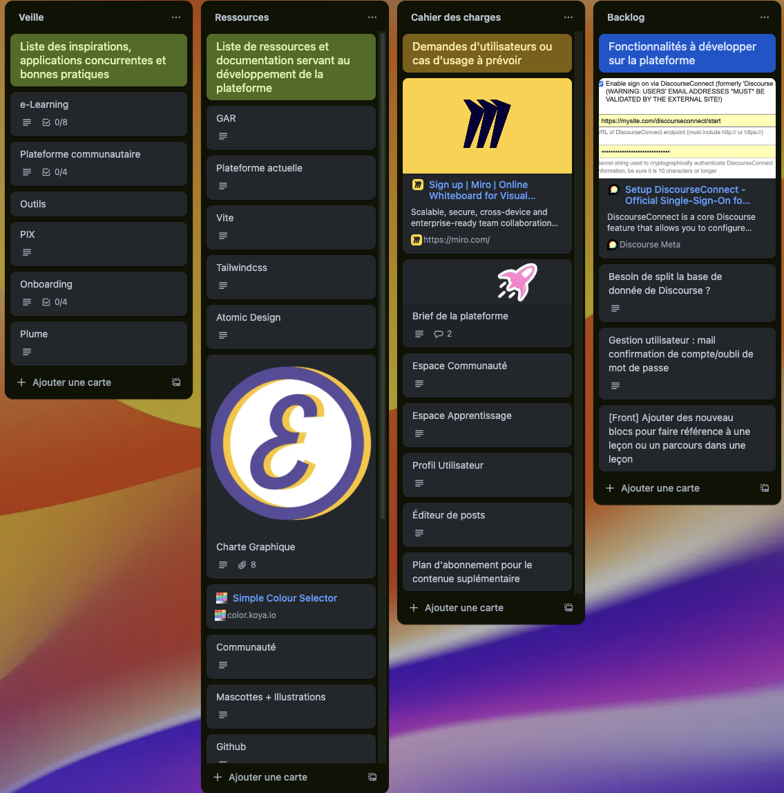

# Conduire un projet

La compétence C5 du BUT Informatique, intitulée *Conduire un projet*, est une compétence clé qui englobe l’identification des besoins, la planification, la gestion des ressources et la supervision de la réalisation technique. Elle est essentielle pour mener à bien des projets informatiques complexes, en garantissant à la fois la qualité, les délais et l'adéquation aux attentes des utilisateurs.  

En troisième année, elle est validée via les UE 5.5 et 6.5, avec pour objectif :  
**Participer à la conception et à la mise en œuvre d’un projet système d’information.**

## Objectifs de la compétence C5

Cette compétence permet de :

- Identifier et analyser les besoins des parties prenantes.
- Planifier et organiser les différentes étapes du projet.
- Gérer les ressources et les priorités.
- Assurer le suivi de l’avancement et de la qualité.
- Anticiper les évolutions et les risques du projet.

## [Projet Plateforme Elio Academy](projects/projet-plateforme)

### Contexte du projet

Dans le cadre du projet **Plateforme Elio Academy**, j’ai été impliqué dans la conduite du projet aux côtés de Romain Boutrois, fondateur d'ELIO et mon tuteur.

Mon rôle a été d’accompagner le projet en apportant une expertise technique pour guider les choix structurants dès le démarrage, en prenant en compte :

- les besoins immédiats pour la première version de la plateforme (MVP),
- les contraintes techniques et fonctionnelles,
- mais aussi les perspectives d’évolution à court, moyen et long terme.

### Analyse des besoins et étude de l’existant

Avant de démarrer la conception technique, nous avons mené un travail d’analyse des besoins :

- Revue complète des fonctionnalités déjà présentes dans le WordPress existant.
- Recueil des besoins des utilisateurs finaux (enseignants, élèves, utilisateurs).
- Analyse comparative de la concurrence en étudiant plusieurs solutions existantes sur le marché des plateformes pédagogiques :
  - Identification des fonctionnalités courantes et innovantes.
  - Repérage des limites et des points faibles des solutions concurrentes.
  - Définition des axes de différenciation pour notre projet.

Cette phase nous a permis de cadrer le périmètre fonctionnel de la future plateforme, de disposer d’une vision claire du produit à construire et de commencer à faire émerger des fonctionnalités qui ont été poser sur nôtre backlog qui se trouve sur un Trello.

> Petite partie du Trello utilisé pour le suivi du projet, c'est la que nous avons posé toute nos inspirations, bonne pratiques et les fonctionnalités que nous souhaitions implémenter dans la plateforme.

### Planification du projet

Sur la base de l’analyse des besoins, nous avons établi une planification progressive et réaliste du projet en définissant :

- Les priorités fonctionnelles pour le MVP.
- L'ordre de conception des différentes briques techniques.
- Les jalons intermédiaires pour valider chaque étape.
- Les éléments à anticiper pour les évolutions futures (application mobile, nouveaux types de contenus, multilangues etc.).

Cette planification m’a permis d’organiser efficacement le travail technique, d'anticiper les points complexes et de sécuriser l’avancement régulier du projet.

#### Gestion des ressources et prise de décision

Tout au long du projet, j’ai accompagné Romain dans les prises de décisions stratégiques, en exposant les différentes options possibles (choix techniques, architecture, technologies, priorités de développement).

J’ai également participé à :

- L’évaluation des charges de travail.
- La priorisation des tâches en fonction des délais et ressources disponibles.
- L’anticipation des contraintes techniques futures (performances, maintenabilité, sécurité, scalabilité).

### Vision long terme

Une partie importante de mon rôle a été d’apporter une vision projet sur plusieurs horizons :

- **Court terme** : livrer rapidement un MVP fonctionnel remplaçant l’ancien système WordPress.
- **Moyen terme** : concevoir une architecture technique robuste, permettant l’intégration de nouveaux modules.
- **Long terme** : anticiper les besoins futurs (développement mobile, connexion au GAR, gestion de la montée en charge des utilisateurs).

### Exemples concrets

#### 1. Des choix techniques adaptés au contexte

Le projet de plateforme contient une forte dimension communautaire, inspirée de l’univers des makers (exemples : Printables, MakerWorld, etc.).

Pour concevoir le MVP, nous avons sollicité un groupe d’étudiants de l’Université de La Rochelle, qui a pu réaliser un premier prototype en 5 semaines. Ce délai très court m’a amené à effectuer des choix techniques afin de maximiser les fonctionnalités livrables dans le temps imparti.

L’un des choix les plus structurants a concerné la partie communautaire. Initialement, le développement d’un "réseau social" interne était envisagé. Cependant, cette option aurait nécessité des ressources de développement trop importantes, d’autant que cette fonctionnalité était absente du WordPress d’origine, et donc non prioritaire pour le MVP.

Afin de répondre au besoin tout en respectant les contraintes de temps et de ressources, j’ai recherché des solutions existantes et éprouvées. J’ai identifié la solution **[Discourse](https://www.discourse.org/)**, une plateforme open-source de forums communautaires très largement utilisée (Arduino, Raspberry Pi, etc.). 

Discourse présentait de nombreux avantages :

- Intégration facilitée avec la plateforme existante.
- Fonctionnalités communautaires avancées (discussions, notifications, modération, recherche, etc.).
- Solution mature, maintenue et évolutive.
- Charge de développement nettement réduite comparée à un développement from scratch.

Ce choix nous a permis d’intégrer rapidement une dimension communautaire, tout en restant concentrés sur le développement des fonctionnalités pédagogiques principales de la plateforme.

#### 2. Contraintes techniques et évolutions

Lors de la réception du MVP, nous avons constaté que certaines fonctionnalités initialement prévues n’étaient pas réalisables avec l'architecture actuelle. De plus les infrastructure disponible chez elio n'était pas dimensioné pour supporté l'architecture prévue par le groupe d'étudiants qui ont conçue le MVP.
Pour pallier ces limitations, j’ai proposé une révision complète de l’architecture technique, en tenant compte des contraintes suivantes :
- **Scalabilité** : la plateforme doit pouvoir accueillir un nombre croissant d’utilisateurs sans dégradation des performances.
- **Modularité** : permettre l’ajout de nouvelles fonctionnalités sans refonte majeure.
- **Evolutivité** : anticiper les besoins futurs (applications mobiles, nouvelles briques fonctionnelles).

J’ai donc proposé dans un premier temps de séparer les repo git front-end et back-end de la plateforme, afin de permettre une évolution indépendante des deux parties.

Cette séparation a permis de :
- Simplifier le développement et de bien séparer les responsabilités.
- Faciliter le déploiement et la maintenance en production(possible de déployer le front sans toucher au back-end et vice-versa).
- Permettre la futur intégration d’une application mobile sans impacter l’architecture existante.

C'était une étape nécessaire pour permettre l’évolution de la plateforme vers une architecture plus robuste et évolutive.

La deuxième étape a été de revoir l’architecture logicielle , en proposant une nouvelle structure basée sur les principes suivants :
- **Une seule Base de données** pour l’ensemble de la plateforme, permettant une gestion centralisée des données des coûts moins important bien au niveau de l'infrastructure que de la maintenance.

## [Projet Suivie de Ligne Autonome](projects/projet-tut)

Dans le cadre du projet **Suivi de Ligne Autonome**, j’ai été amené à conduire le projet de bout en bout, en partant de la collecte des données jusqu’au déploiement du modèle sur un microcontrôleur.
 j'était seul responsable de la gestion du projet, de la planification à la réalisation technique.
 Sur le plan téchnique j'ai été accompagné par mon tuteur de stage, Romain Boutrois, qui m'a aidé à définir les objectifs et les contraintes du projet , ainsi que par Cyrille Suire, mon référent pédagogique à l'IUT, qui a validé le projet et m'a apporté son expertise.

### Analyse des besoins et planification
Avant de démarrer le projet, j’ai réalisé une analyse des besoins en collaboration avec Romain Boutrois. Nous avons défini les objectifs suivants :

- Vérifier si Eliobot pouvait être utilisé comme support pour l’apprentissage de l’IA et de la robotique.
- Concevoir un système capable de suivre une ligne de manière autonome en utilisant un modèle d’intelligence artificielle.
- Développer un modèle léger pouvant être déployé sur un microcontrôleur ESP32-S2.
- Assurer la documentation et la reproductibilité du projet pour une utilisation pédagogique.

### Conception et développement

Pour répondre à ces besoins, j’ai réaliser le projet en plusieurs étapes :
1. **Collecte des données** : J’ai conçu un protocole de collecte des données en situation réelle, en utilisant les capteurs infrarouges du robot Eliobot pour enregistrer les valeurs des capteurs et les commandes des moteurs.
2. **Entraînement du modèle** : J’ai utilisé une librairie pour entraîner un modèle de décision à partir des données collectées, en veillant à ce qu’il soit suffisamment léger pour être exécuté sur Eliobot.
3. **Conversion et déploiement** : J’ai converti le modèle en un model plus léger pour le rendre compatible avec Eliobot, puis j’ai développé le code de contrôle du robot pour intégrer le modèle.

### Autonomie et esprit critique

Même si j’étais seul à conduire ce projet, ça ne veut pas dire que c’était plus simple. Au contraire, il a fallu que je sois capable de prendre du recul sur mon travail, d’évaluer mes choix, et parfois de me remettre en question.

Pour ça, j’ai sollicité régulièrement l’avis de mon tuteur, mais aussi de mon entourage (amis développeurs ou pas), pour m’aider à valider certaines idées ou m’alerter quand je prenais une mauvaise direction.

J’ai aussi documenté chaque étape du projet, pour que le résultat soit compris, réutilisable et pédagogique. Par exemple, j’ai volontairement choisi de rester sur un firmware en Python, afin de pouvoir connecter le projet à notre application Elioblocs, qui permet de programmer Eliobot à l'aide de blocs qui font du code Python.

---

### Apports liés à la compétence C5

L'ensemble de ces expériences illustre concrètement l’acquisition de la compétence C5.

À travers deux projets très différents l’un en équipe avec des itérations collectives, l’autre en autonomie avec une forte capacité d’adaptation j’ai su utiliser les principes de la gestion de projet agile pour assurer la réussite des livrables tout en m’adaptant aux contraintes et aux évolutions.

#### Compétences mobilisées

Ces expériences m’ont permis de :

- Cadrer les attentes et rédiger une vision produit claire.
- Structurer un backlog et définir des priorités réalistes.
- Participer activement à la prise de décision technique, en lien avec la stratégie produit.
- Mettre en place des outils de suivi agiles pour garantir la qualité et l’avancement.
- Collaborer de manière efficace avec les parties prenantes dans un esprit de transparence et d’adaptation.

J’ai particulièrement apprécié cette compétence car elle m’a permis de me positionner dans un rôle proche de celui d’un **Product Owner** : comprendre les besoins, définir les priorités, suivre les évolutions et assurer la cohérence globale du projet.

Cette posture m’a conforté dans l’idée que je souhaite évoluer vers des fonctions qui allient vision produit, pilotage de projet et accompagnement technique.
