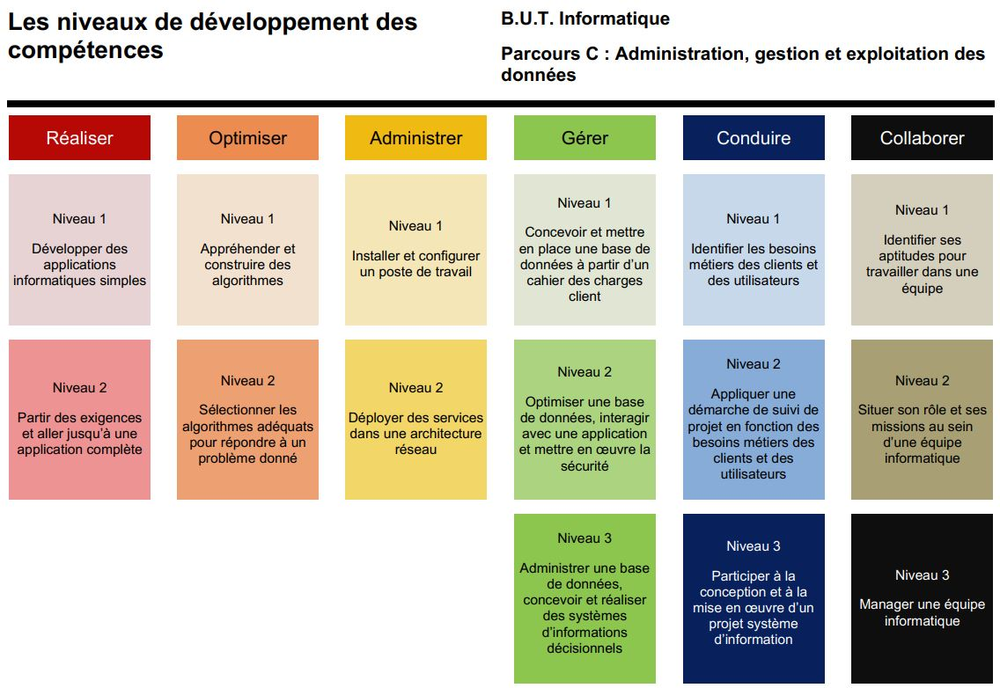

# Compétences

## Réaliser

### 1. Développer des applications informatiques simples

Développement de l’interface pour Adélaïde, gestionnaire de missions.

### 2. Partir des exigences pour aller jusqu’à une application complète

Analyse des besoins d’Adélaïde et évolution de l’application pour y répondre efficacement.

## Optimiser

### 1. Comprendre et construire des algorithmes

Mise en place d'une méthode de vérification des mises à jour pour le robot Eliobot.

### 2. Choisir les bons algorithmes pour répondre à un problème

Optimisation du système de gestion des mises à jour et amélioration de sa fiabilité.

## Administrer

### 1. Installer et configurer un poste de travail

Expérience sur un VPS en entreprise, sécurisation...

### 2. Déployer des services dans une architecture réseau

Déploiement de la plateforme sur un VPS : séparation base de données / API / application, configuration des redirections via reverse proxy.

## Gérer

### 1. Concevoir et mettre en place une base de données selon un cahier des charges client

### 2. Optimiser une base de données, interagir avec une application et mettre en œuvre la sécurité

### 3. Administrer une base de données et concevoir des systèmes d'information décisionnels

## Conduire

### 1. Identifier les besoins métiers des clients et utilisateurs

Étude préparatoire pour la mise en place de la plateforme en entreprise.

### 2. Suivre un projet en fonction des besoins métiers

Participation active au suivi et à l’amélioration continue de la plateforme.

### 3. Participer à la conception et à la mise en œuvre d’un système d’information

Conception globale de la plateforme, de sa gestion et des pistes d’évolution.

## Collaborer

### 1. Identifier ses aptitudes au travail en équipe

Adaptation de mon rôle au sein de l’équipe en tenant compte de mon niveau technique moins avancé, et complémentarité avec les autres membres.

### 2. Situer son rôle et ses missions dans une équipe informatique

Rôle de Product Owner (PO) dans le projet de SAE pour Adélaïde, en gérant les caractères forts de l’équipe.

### 3. Encadrer une équipe informatique

Responsabilité d’encadrement dans un projet tutoré, avec l’équipe parcours A de La Rochelle et des stagiaires (un BUT2, un BUT3, une game designeuse) d’avril à septembre.

Fil rouge 3 compétence c4 c5 c6, projet tut pour c4 et plateforme pour c5 et c6 contexte de l'entreprise
